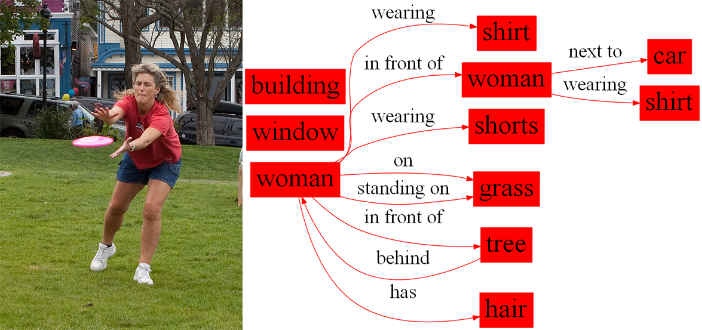
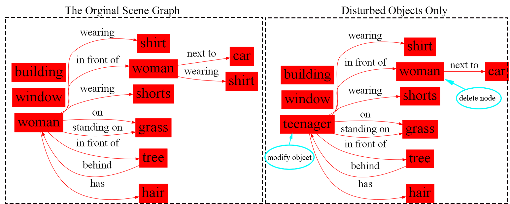
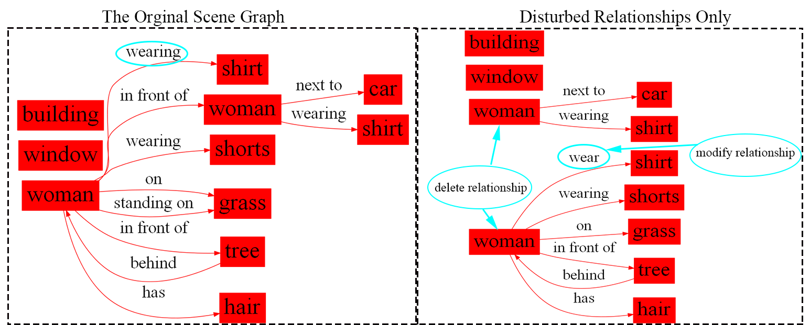
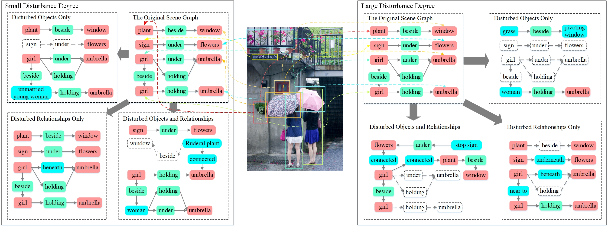

# Introduction

In General, a scene graph dataset for image retrieval is proposed. The dataset is built on Justin’s image retrieval dataset and the first 101 objects with the highest occurrence frequency and the first 99 relationships are retained to generate the original scene graph.

When constructing the scene semantic graph, each node is built with node index and semantic vector of the corresponding object labels. Each edge is built with edge connection information and semantic vector of the relationship. All semantic vectors are generated by Word2Vec or ConceptNet. 

# Dataset statistics

The dataset contains 3 parts. For each of them, there are 1000 original scene graphs used to generate the disturbed graph. Each original graph is disturbed by three methods: disturbed objects only, disturbed relationships only and both of them. According to each method, it is generated 40 disturbed graphs, respectively. Thus, each original scene graph is paired with 120 disturbed graph and there will be 120000 graph pairs in total per part. Here is an example of turning a image to scene graph.

## Semantically Similar Words

The word vector generation tools: Word2vec and ConceptNet are used to transforms the word representation of an object or relationship into a vector.

- For objects, 10 words or phrases semantically closed to the target object are generated by artificial statistics, Word2vec and ConceptNet.
- For relationships, 5 words or phrases semantically closed to the target relationship are generated by ConceptNet.

Here are the details for each part. These semantically similar words will be used in subsequent disturbances to scene graphs.

### Part 1

The semantically similar words of the object's name in this part are selected based on the images corresponding to the bounding boxes of the objects in other scene graphs that are manually viewed and filtered. 10 semantically similar words are selected for each object.

The relationships in this part have no semantically similar words.

In this part, Word2Vec is used to turn the words into semantic vectors.

### Part 2

The semantically similar words of the object's name in this part are selected from the semantic space of Word2Vec due to the distance between vectors can be used to represent the semantic similarity in text. 10 semantically similar words are selected for each object.

The relationships in this part have no semantically similar words.

In this part, Word2Vec is used to turn the words into semantic vectors.

### Part 3

The semantically similar words of the object's name in this part are selected from the semantic space of ConceptNet. 10 semantically similar words are selected for each object.

The semantically similar words of the relationship in this part are also selected from the semantic space of ConceptNet. 5 semantically similar words are selected for each object. 

In this part, ConceptNet is used to turn the words into semantic vectors.

## Disturbance Strategies

For the chosen 101 objects and 99 relationships, there are two disturbance strategies for objects and three for relationships, respectively.

- For objects, disturbances include modifying some object names with the semantically similar words and deleting some objects.

  

- For relationships, disturbances include modifying several relationships with the semantically similar words, adding relationships and deleting relationships. 

  

For Part 1 and Part 2 of the dataset, the object disturbed methods use modifying the object's name and deleting the object, the relationship disturbed methods use adding relationships and deleting relationships.

For Part 3 of the dataset, the object disturbed methods use modifying the object's name and deleting the object, the relationship disturbed methods use modifying relationships and deleting relationships.

# Dataset Format

Each folder contains a scene graph corresponding to the image and three types of disturbed graphs (disturb objects, disturb relationships, and disturb objects and relationships). Each scene graph has a corresponding json file and a jpg format diagram. In addition, the GED of the disturbed graph and the original graph are in the folder of each perturbation graph.

