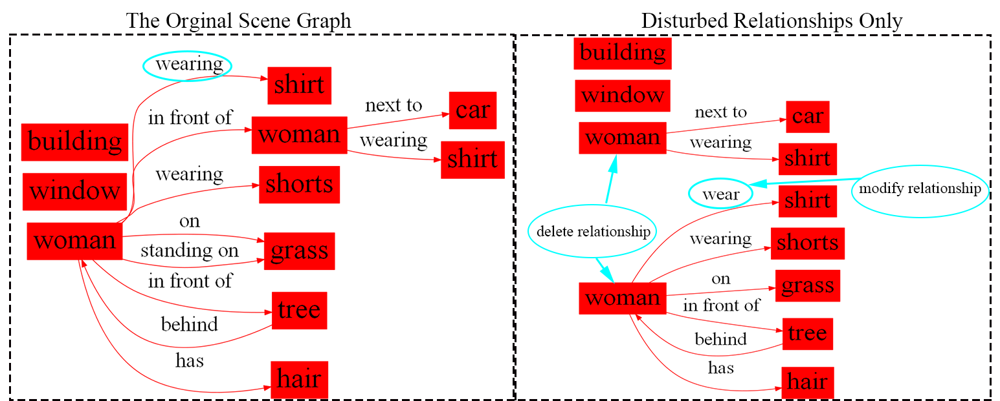

# Introduction

In General, a dataset for image retrieval based on scene graph is proposed. The dataset contains 3 parts, which is built on Johnson’s image retrieval dataset and the first 101 objects with the highest occurrence frequency and the first 99 relationships are retained to generate the original scene graph. 

When constructing the scene semantic graph, each node is built with node index,  semantic vector of the corresponding object's name,  and semantic vectors of the corresponding object's attribute.  Each edge is built with edge connection information and semantic vector of the relationship which is corresponded with the edge. All semantic vector is generated by Word2Vec or ConceptNet. 

The scene graphs is presented in the form of json files, which can be used directly for model training.

# Dataset statistics

The dataset contains 3 parts. For each of them, there are 1000 original scene graphs used to generate the disturbed graph. Each original graph is disturbed by three methods: disturbed nodes only, disturbed edges only and both of them. According to each method, it is generated 40 disturbed graphs, respectively. Half of the disturbed graphs are the positive samples and half are negative samples. Thus, each original scene graph is paired with 120 disturbed graph and there will be120000 graph pairs in total per part. Here is an example of turning a image to scene graph.

## Semantically Similar Words

Starting from the basic 5,000-picture dataset, the 101 objects and 99 relationships with the most occurrences frequency are extracted from it.

- For objects, 10 words or phrases semantically closed to the target object are generated by artificial statistics or semantic vector mapping tools.
- For relationships, 5 words or phrases semantically closed to the target relationship are generated by ConceptNet. In addition, some relationships having less than 5 semantically similar words are eliminated, so there are only 66 relationships that can be changed semantically. 

Here are the details for each part. These semantically similar words will be used in subsequent disturbances to scene graphs.

### Part 1

The semantically similar words of the object's name in this part are selected based on the images corresponding to the bounding boxes of the objects in other scene graphs that are manually viewed and filtered. A total of 101 types of objects have semantically similar words and 10 semantically similar words are selected for each object.

The relationships in this part have no  semantically similar words.

In this part, Word2Vec is used to turn the words into semantic vectors.

### Part 2

The semantically similar words of the object's name in this part are selected from the semantic space of Word2Vec due to the distance between vectors can be used to represent the semantic similarity in text. A total of 101 types of objects have semantically similar words and 10 semantically similar words are selected for each object.

The relationships in this part have no  semantically similar words.

In this part, Word2Vec is used to turn the words into semantic vectors.

### Part 3

The semantically similar words of the object's name in this part are selected from the knowledge base of ConceptNet.  A total of 101 types of objects have semantically similar words and 10 semantically similar words are selected for each object.

The semantically similar words of the relationship in this part are also selected from the knowledge base of ConceptNet. A total of 66 types of relationships have semantically similar words and 5 semantically similar words are selected for each object. 

In this part, ConceptNet is used to turn the words into semantic vectors.

## Disturbance Strategies

For the chosen 101 objects and 99 objects, the semantically similar words are used to disturb the scene graphs. There are two disturbance strategies for objects(nodes) and three for relationships (edges), respectively.

- For nodes, disturbances include modifying the word form or meanings of some objects with the semantically similar words and deleting nodes.

  

- For edges, disturbances include modifying relationships of edges with the semantically similar words, adding edges and deleting edges. 

  

For Part 1 and Part 2 of the dataset, the node disturbed methods use modifying the object's name and deleting the node, the edge disturbed methods use adding edges and deleting edges.

For Part 3 of the dataset,  the node disturbed methods use modifying the object's name and deleting the node, the edge disturbed methods use  modifying relationships of edges, adding edges and deleting edges. For relationships that need to be modified with the semantically similar words but do not have any of them, delete the edge.

# Dataset Format & Download

sg_image directory contains 1000 original image data, file format is jpg

There are a total of 1000 folders in the scene_graph directory. Each folder contains a scene graph corresponding to the image and three types of disturbed graphs (disturb only nodes, disturb only edges, and disturb nodes and edges).  Each scene graph has a corresponding json file and a jpg format diagram. In addition, the similarity label and GED of the disturbed graph and the original graph are in the folder of each perturbation graph.

